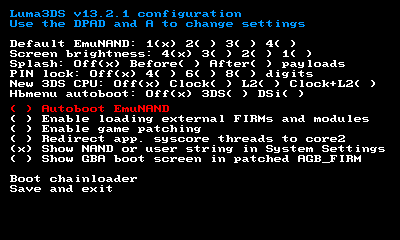
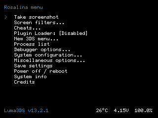

# Luma3DS

*Nintendo 3DS "Custom Firmware"*

## Description
**Luma3DS** patches and reimplements significant parts of the system software running on all models of the Nintendo 3DS family of consoles. It aims to greatly improve the user experience and support the 3DS far beyond its end-of-life. Features include:

* **First-class support for homebrew applications**
* **Rosalina**, an overlay menu (triggered by <kbd>L+Down+Select</kbd> by default), allowing things like:
    * Taking screenshots while in game
    * Blue light filters and other screen filters
    * Input redirection to play with external devices, such as controllers
    * Using cheat codes
    * Setting time and date accurately from the network (NTP)
    * ... and much more!
* **Many game modding features**, such as, but not limited to:
    * Game plugins (in 3GX format)
    * Per-game language overrides ("locale emulation")
    * Asset content path redirection ("LayeredFS")
* **Support for user-provided patches and/or full "system modules" replacements**, an essential feature for Nintendo Network replacements (amongst other projects)
* A **fully-fledged GDB stub**, allowing homebrew developers and reverse-engineers alike to work much more efficiently
* Ability to chainload other firmware files, including other versions of itself
* ... and much more!

## Installation and upgrade
Luma3DS requires [boot9strap](https://github.com/SciresM/boot9strap) to run.

Once boot9strap has been installed, simply download the [latest release archive](https://github.com/LumaTeam/Luma3DS/releases/latest) and extract the archive onto the root of your SD card to "install" or to upgrade Luma3DS alongside the [homebrew menu and certs bundle](https://github.com/devkitPro/3ds-hbmenu) shipped with it. Replace existing files and merge existing folders if necessary.

## Basic usage
**The main Luma3DS configuration menu** can be accessed by pressing <kbd>Select</kbd> at boot. The configuration file is stored in `/luma/config.ini` on the SD card (or `/rw/luma/config.ini` on the CTRNAND partition if Luma3DS has been launched from the CTRNAND partition, which happens when SD card is missing).

**The chainloader menu** is accessed by pressing <kbd>Start</kbd> at boot, or from the configuration menu. Payloads are expected to be located in `/luma/payloads` with the `.firm` extension; if there is only one such payload, the aforementionned selection menu will be skipped. Hotkeys can be assigned to payload, for example `x_test.firm` will be chainloaded when <kbd>X</kbd> is pressed at boot.

**The overlay menu, Rosalina**, has a default button combination: <kbd>L+Down+Select</kbd>. For greater flexbility, most Rosalina menu settings aren't saved automatically, hence the "Save settings" option.

**GDB ports**, when enabled, are `4000-4002` for the normal ports. Use of `attach` in "extended-remote" mode, alongside `info os processes` is supported and encouraged (for reverse-engineering, also check out `monitor getmemregions`). The port for the break-on-start feature is `4003` without "extended-remote". Both devkitARM-patched GDB and IDA Pro (without "stepping support" enabled) are actively supported.

We have a wiki, however it is currently very outdated.

## Components

Luma3DS consists of multiple components. While the code style within each component is mostly consistent, these components have been written over many years and may not reflect how maintainers would write new code in new components/projects:

* **arm9**, **arm11**: baremetal main settings menu, chainloader and firmware loader. Aside from showing settings and chainloading to other homebrew firmware files on demand, it is responsible for patching the official firmware to modify `Process9` code and to inject all other custom components. This was the first component ever written for this project, in 2015
* **k11_extension**: code extending the Arm11 `NATIVE_FIRM` kernel (`Kernel11`). It is injected by the above mentioned baremetal loader into the kernel by hooking its startup code, then hooks itself into the rest of the kernel. Its features include hooking system calls (SVCs), introducing new SVCs and hooking into interprocess communications, to bypass limitations in Nintendo's system design. This is the component that allows Rosalina to pause other processes on overlay menu entry, for example. This was written at a time when we didn't fully reverse-engineer the kernel, and originally released in 2017 alongside Rosalina. Further hooks for "game plugin" support have been merged in 2023
* **sysmodules**: reimplementation of "system modules" (processes) of the 3DS's OS (except for Rosalina being custom), currently only initial processes loaded directly in-memory by the kernel ("kernel initial process", or KIP in short)
    * **loader**: process that loads non-KIP processes from storage. Because this is the perfect place to patch/replace executable code, this is where all process patches are done, enabling in particular "game modding" features. This is also the sysmodule handling 3DSX homebrew loading. Introduced in 2016
    * _**rosalina**_: the most important component of Luma3DS and custom KIP: overlay menu, GDB server, `err:f` (fatal error screen) reimplementation, and much more. Introduced in mid-2017, and has continuously undergone changes and received many external contributions ever since
    * **pxi**: Arm11<>Arm9 communication KIP, reimplemented just for the sake of it. Introduced late 2017
    * **sm**: service manager KIP, reimplemented to remove service access control restrictions. Introduced late 2017
    * **pm**: process manager KIP reponsible of starting/terminating processes and instructing `loader` to load them. The reimplemention allows for break-on-start GDB feature in Rosalina, as well as lifting FS access control restrictions the proper way. Introduced in 2019

## Maintainers

* **[@TuxSH](https://github.com/TuxSH)**: lead developer, created and maintains most features of the project. Joined in 2016
* **[@AuroraWright](https://github.com/AuroraWright)**: author of the project, implemented the core features (most of the baremetal boot settings menu and firmware loading code) with successful design decisions that made the project popular. Created the project in 2015, currently inactive
* **[@PabloMK7](https://github.com/PabloMK7)**: maintainer of the plugin loader feature merged for the v13.0 release. Joined in 2023

## Roadmap

There are still a lot more features and consolidation planned for Luma3DS! Here is a list of what is currently in store:

* Full reimplementation of `TwlBg` and `AgbBg`. This will allow much better, and more configurable, upscaling for top screen in DS and GBA games (except on Old 2DS). This is currently being developed privately in C++23 (no ETA). While this is quite a difficult endeavor as this requires rewriting the entire driver stack in semi-bare-metal (limited kernel with no IPC), this is the most critical feature for Luma3DS to have and will make driver sysmodule reimpelementation trivial
* Reimplementation of `Process9` for `TWL_FIRM` and `AGB_FIRM` to allow for more features in DS and GBA compatibility mode (ones that require file access)
* Eventually, a full `Kernel11` reimplementation

## Known issues

* **Cheat engine crashes with some applications, in particular Pokémon games**: there is a race condition in Nintendo's `Kernel11` pertaining to attaching a new `KDebugThread` to a `KThread` on thread creation, and another thread null-dereferencing `thread->debugThread`. This causes the cheat engine to crashes games that create and destroy many threads all the time (like Pokémon).
    * For these games, having a **dedicated "game plugin"** is the only alternative until `Kernel11` is reimplemented.
* **Applications reacting to Rosalina menu button combo**: Rosalina merely polls button input at an interval to know when to show the menu. This means that the Rosalina menu combo can sometimes be processed by the game/process that is going to be paused.
    * You can **change the menu combo** in the "Miscellaneous options" submenu (then save it with "Save settings" in the main menu) to work around this.

## Building from source

To build Luma3DS, the following is needed:
* git
* [makerom](https://github.com/jakcron/Project_CTR) in `$PATH`
* [firmtool](https://github.com/TuxSH/firmtool) installed
* up-to-date devkitARM and libctru:
    * install `dkp-pacman` (or, for distributions that already provide pacman, add repositories): https://devkitpro.org/wiki/devkitPro_pacman
    * install packages from `3ds-dev` metapackage: `sudo dkp-pacman -S 3ds-dev --needed`
    * while libctru and Luma3DS releases are kept in sync, you may have to build libctru from source for non-release Luma3DS commits

While Luma3DS releases are bundled with `3ds-hbmenu`, Luma3DS actually compiles into one single file: `boot.firm`. Just copy it over to the root of your SD card ([ftpd](https://github.com/mtheall/ftpd) is the easiest way to do so), and you're done.

## Licensing
This software is licensed under the terms of the GPLv3. You can find a copy of the license in the LICENSE.txt file.

Files in the GDB stub are instead triple-licensed as MIT or "GPLv2 or any later version", in which case it's specified in the file header. PM, SM, PXI reimplementations are also licensed under MIT.

## Credits

Luma3DS would not be what it is without the contributions and constructive feedback of many. We would like to thanks in particular:

* **[@devkitPro](https://github.com/devkitPro)** (especially **[@fincs](https://github.com/fincs)**, **[@WinterMute](https://github.com/WinterMute)** and **[@mtheall](https://github.com/mtheall)**) for providing quality and easy-to-use toolchains with bleeding-edge GCC, and for their continued technical advice
* **[@Nanquitas](https://github.com/Nanquitas)** for the initial version of the game plugin loader code as well as very useful contributions to the GDB stub
* **[@piepie62](https://github.com/piepie62)** for the current implementation of the Rosalina cheat engine, **Duckbill** for its original implementation
* **[@panicbit](https://github.com/panicbit)** for the original implementation of screen filters in Rosalina
* **[@jasondellaluce](https://github.com/jasondellaluce)** for LayeredFS
* **[@LiquidFenrir](https://github.com/LiquidFenrir)** for the memory viewer inside Rosalina's "Process List"
* **ChaN** for [FatFs](http://elm-chan.org/fsw/ff/00index_e.html)
* Everyone who has contributed to the Luma3DS repository
* Everyone who has assisted with troubleshooting end-users
* Everyone who has provided constructive feedback to Luma3DS
